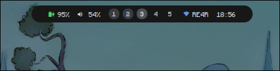
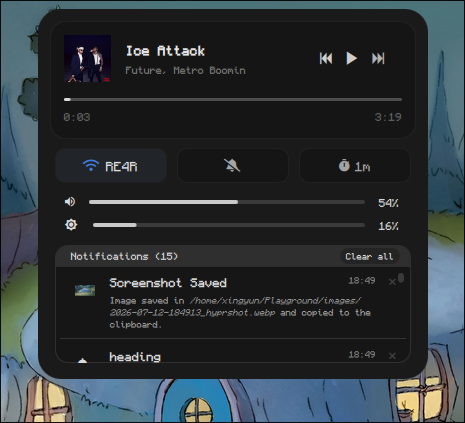
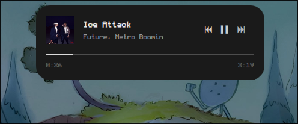
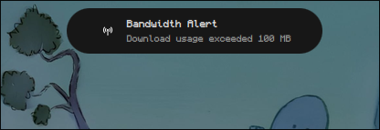
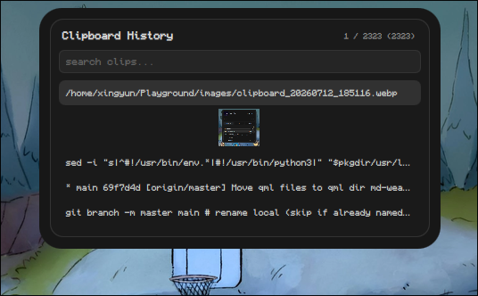
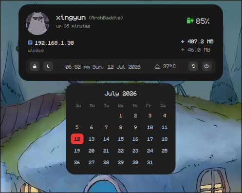
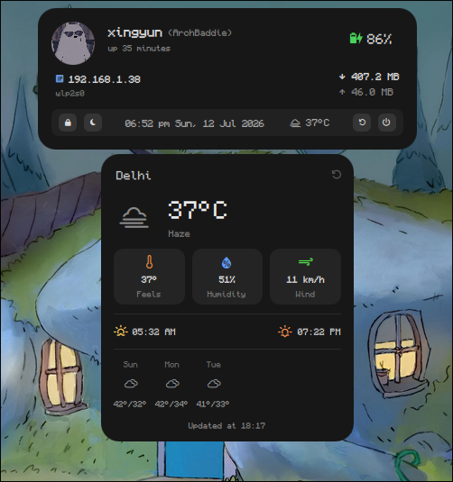
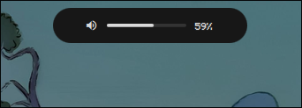

# ChillPill-Shell

A Lightweight and Feature-Rich dynamic pill shape bar made in Quickshell especially for those who don't have a Dedicated GPU (Like me) for their GNU/Linux Hyprland machine.

[](https://github.com/LUCKYS1NGHH/ChillPill-Shell)
[](https://github.com/quickshell-mirror/quickshell)
[](https://www.gnu.org/licenses/gpl-3.0)

---

### Resource Usage

- RAM: 200-600 MB (Average 400)
- CPU: Idle 0%, Average 3%, Min 0.1%, Max 10%
- GPU: Idle 0%, Average 15%, Min 6%, Max 50%

> CPU and GPU usage varies with system. a better CPU and GPU use less.

#### My Hardware

- RAM: 8GB (DDR3)
- CPU: i5 3337U (Dualcore)
- GPU: Intel HD 4000 (Integrated)

---

### Showcase

<table>
  <tr>
    <td width="50%">
      <p align="center"><b>Main pill bar</b></p>
      
    </td>
    <td width="50%">
      <p align="center"><b>Control center</b></p>
      
    </td>
  </tr>
  <tr>
    <td width="50%">
      <p align="center"><b>Media player auto-open on media playing</b></p>
      
    </td>
    <td width="50%">
      <p align="center"><b>Notification popup (nusgmon-alert)</b></p>
      
    </td>
  </tr>
  <tr>
    <td width="50%">
      <p align="center"><b>Cliphist (clipboard manager)</b></p>
      
    </td>
    <td width="50%">
      <p align="center"><b>Mini dashboard — calendar</b></p>
      
    </td>
  </tr>
  <tr>
    <td width="50%">
      <p align="center"><b>Mini dashboard — weather</b></p>
      
    </td>
    <td width="50%">
      <p align="center"><b>Volume OSD (has more OSDs like brightness, battery, timer)</b></p>
      
    </td>
  </tr>
</table>

### Features

- Main Pill Bar                : Battery, volume, workspaces, network, clock
- Control Center               : Media Player, Buttons (WiFi, Silent Notifications, Timer), Volume and Brightness Sliders, Notifications Stack
- Cliphist (Clipboard History) : Search, Clipboard images preview, Item index number
- Mini Dashboard               : Profile Image, Username, Hostname, Uptime, Battery, Basic network info, Today bandwidth usage, Datetime, Weather, Calendar, Power buttons (lock, sleep, shutdown, reboot)
- DBus Notification            : App icon (optional), summary, body (YES! you can ditch swaync/dunst fully now)
- OSD                          : Battery, volume, brightness, timer

<details>
<summary>Know more</summary>

---
- Main pill bar width expands on hover
- Audio (to mute/unmute) and workspaces (to switch) in the main pill bar are clickable.
- Control center has WiFi controller which has list of active networks and has password prompt. also timer minutes can be change by right
  click.
- Cliphist shows image previews from `~/.cache/quickshell/cliphist-imgs` by converting image binaries into real images and save there.
- Notifications are able to show in slide animation (like iOS mute) while you playing video game or watching movie in full screen.
  also it can show custom app icon to show in notification, else it shows bell icon.
- Your today's bandwidth status in mini dashboard is shown by [nusgmon](https://github.com/LUCKYS1NGHH/nusgmon) (i am the creator of it too).
---
</details>

### Configurable options

> Located at ~/.config/chillpill-shell/config.jsonc

```
{
  "displayPicture": "/home/<user>/.pfp.png",
  "clockFormat": "hh:mm",
  "pillTopMargin": 9,
  "pillBottomMargin": 26,
  "textFontFamily": "Monocraft",
  "nerdFontFamily": "JetBrainsMono Nerd Font Propo",
  "timerPresets": [1, 5, 10, 15, 30],
  "mediaAutoOpenDuration": 2000,
  "maxWorkspaces": 5,
  "notificationDisplayTime": 3000,
  "maxNotificationsInStack": 20,
  "bandwidthRefreshInterval": 300000,
  "screenLockAppCommand": "hyprlock",
  "osdDuration": 800,
  "weatherLocation": "Delhi",
  "weatherUnits": "metric",
  "weatherRefreshInterval": 3600000,
  "avoidDuplicateNotifications": true
}
```

---

### Dependencies

> [!NOTE]
> Currently it's initial release.
> Tested only on **Arch Linux** + **Hyprland**. other setups unsupported for now.
> Packages listed are Arch/AUR names - grab equivalents from your own package manager.
> Also few packages like `brightnessctl` and `cliphist` are likely already installed.

- [cliphist](https://github.com/sentriz/cliphist)
- [nusgmon](https://github.com/LUCKYS1NGHH/nusgmon) (AUR package. non-Arch users can use the setup script instead)
- [inotify-tools](https://github.com/inotify-tools/inotify-tools)
- [brightnessctl](https://github.com/Hummer12007/brightnessctl)
- Qt Multimedia (`qt6-multimedia` on Arch)
- Qt5Compat (`qt6-5compat` on Arch)

---

### Install

> [!TIP]
> Use my Hyprland [dotfiles](https://github.com/LUCKYS1NGHH/dotfiles), it's also made for No Dedicated GPU machines.
> You will get more better performance.

```bash
git clone --depth=1 https://github.com/LUCKYS1NGHH/ChillPill-Shell.git
cd ChillPill-Shell
chmod +x install.sh
sudo ./install.sh
```

<details>
<summary>Uninstall?</summary>

```bash
chmod +x uninstall.sh
sudo ./uninstall.sh
```
</details>

### Auto startup

To auto-run at every time you start your Hyprland, paste this line in your `~/.config/hypr/hyprland.lua` config file

```
hl.exec_cmd("chillpill-shell")
```

---

### Key Bindings

Keybindings are recommended for ChillPill-Shell in your Hyprland, Just paste this code in your Hyprland (Lua) config file.

> Adjust key combinations by your preferences

```
hl.bind(mainMod .. " + CTRL + C",  hl.dsp.exec_cmd("qs ipc -p /usr/share/chillpill-shell call controlCenter toggle"))
hl.bind(mainMod .. " + CTRL + V",  hl.dsp.exec_cmd("qs ipc -p /usr/share/chillpill-shell call cliphist toggle"))
hl.bind(mainMod .. " + CTRL + B",  hl.dsp.exec_cmd("qs ipc -p /usr/share/chillpill-shell call miniDashboard toggle"))
```

---

### Thanks

Special thanks to [enhaoswen](https://github.com/enhaoswen) for the Wi-Fi controller backend for Quickshell.

### Author

LUCKYS1NGHH / https://github.com/LUCKYS1NGHH/ChillPill-Shell
