# ChillPill-Shell

<div align="center">

[](https://github.com/LUCKYS1NGHH/ChillPill-Shell)
[](https://github.com/LUCKYS1NGHH/ChillPill-Shell/stargazers)
[](https://github.com/quickshell-mirror/quickshell)
[](https://www.gnu.org/licenses/gpl-3.0)

ChillPill-Shell is a **lightweight**, feature rich dynamic pill bar for Hyprland, built with **Quickshell**.
It's aimed squarely at users running without a dedicated GPU (like me) — Eye candy for **Integrated-GPU users**.

It runs as a **standalone app**: launch it from your terminal or app launcher when you want it, rather than having it baked
into your session at all times. It's not bound to any dotfiles.

</div>

<div align="center">

[](#resource-usage)
[](#showcase)
[](#features)
[](#configurable-options)
[](#dependencies)
[](#install)
[](#auto-startup)
[](#key-bindings)
[](#contributors)
[](#thanks)
[](#author)

</div>

---

### Resource Usage

- RAM: 200-500 MB (Average 380)
- CPU: Idle 0%, Average 3%, Min 0.1%, Max 10%
- GPU: Idle 0%, Average 15%, Min 6%, Max 45%

> CPU and GPU usage varies with system. a better CPU and GPU use less.

#### My Hardware

- RAM: 8GB (DDR3)
- CPU: i5 3337U (Dual-core)
- GPU: Intel HD 4000 (Integrated)

---

### Showcase

<table>
  <tr>
    <td width="50%">
      <p align="center"><b>Main pill bar</b></p>
      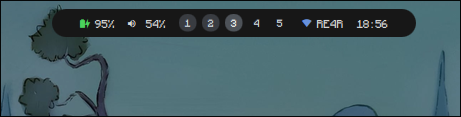
    </td>
    <td width="50%">
      <p align="center"><b>Control center</b></p>
      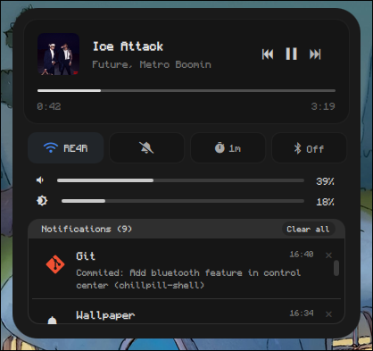
    </td>
  </tr>
  <tr>
    <td width="50%">
      <p align="center"><b>Media playing popup</b></p>
      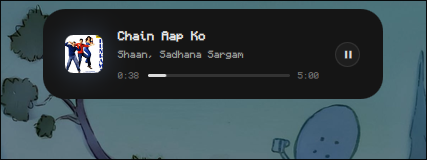
    </td>
    <td width="50%">
      <p align="center"><b>Notification popup (nusgmon-alert)</b></p>
      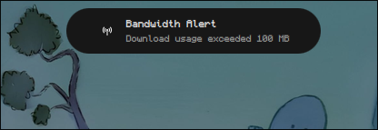
    </td>
  </tr>
  <tr>
    <td width="50%">
      <p align="center"><b>Cliphist (clipboard manager)</b></p>
      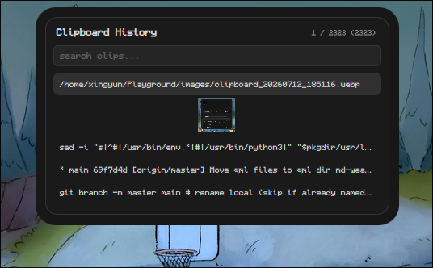
    </td>
    <td width="50%">
      <p align="center"><b>Mini dashboard — calendar</b></p>
      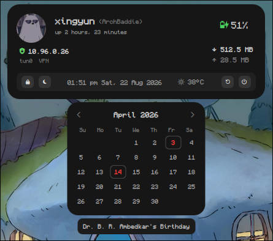
    </td>
  </tr>
  <tr>
    <td width="50%">
      <p align="center"><b>Mini dashboard — weather</b></p>
      
    </td>
    <td width="50%">
      <p align="center"><b>Volume OSD (has more OSDs like brightness, battery, timer)</b></p>
      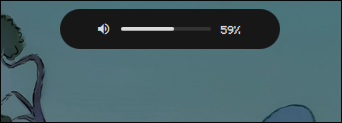
    </td>
  </tr>
  <tr>
    <td width="50%">
      <p align="center"><b>App launcher</b></p>
      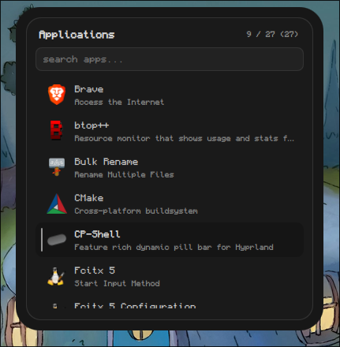
    </td>
    <td width="50%">
      <p align="center"><b>Control center — Wifi and Bluetooth panel</b></p>
      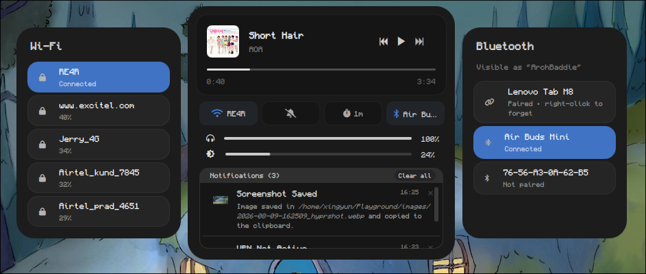
    </td>
  </tr>
  <tr>
    <td width="50%">
      <p align="center"><b>Wallpaper switcher</b></p>
      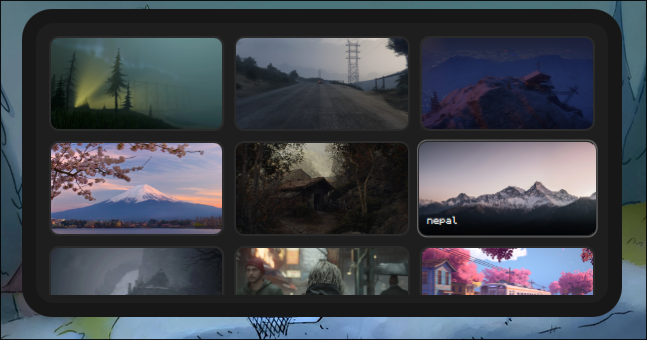
    </td>
    <td width="50%">
      <p align="center"><b>Cliphist — Image full preview tab</b></p>
      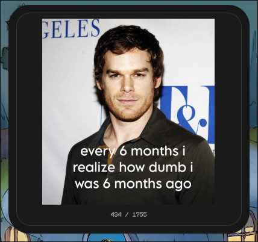
    </td>
  </tr>
</table>

## Features

- **Main Pill Bar**                - Battery, volume, workspaces, network, clock
- **Control Center**               - Media player, buttons (WiFi, Silent Notifs, Timer, Bluetooth), volume and brightness sliders, notification stack
- **Cliphist (Clipboard History)** - Search, clipboard image preview, item index status, `Delete` key to delete any item, `Tab` to full preview the clipboard image
- **Mini Dashboard**               - Profile image, username, hostname, uptime, battery, basic network info, today's bandwidth usage, datetime, weather, calendar, power buttons (lock, sleep, shutdown, reboot)
  - **Calendar Popup**             - Previous/Next month buttons, event dates
  - **Weather Popup**              - Feels, humidity, wind, sunrise and sunset, upcoming 2 days weather forecast, manual refresh button
- **DBus Notification**            - App icon (optional), summary, body (YES! you can ditch swaync/dunst entirely now)
- **OSD**                          - Battery, volume, brightness, timer
- **Wallpaper switcher**           - A wallpaper switcher

<details>
<summary>Know more</summary>

---
- Main pill width expands on hover.

- DPI and Pill scale is available in config if you need it.

- Audio (to mute/unmute) and workspaces (to switch) in the main pill are clickable.

- Control center's media player progress bar is not only for status, it's usable to control the media you playing.

- Control center has WiFi controller which has list of active networks and has password prompt. also timer minutes
  can be change by right click.

- Control center has also Bluetooth controller which has list of active, pair & connected devices/networks, device battery. here's 3 cases to connect a bluetooth device first time:

  - case 1: device wants a PIN or passkey typed in
  - case 2: device just wants us to display a code
  - case 3: device wants a yes/no confirmation of a shown passkey

- Cliphist shows image previews from `~/.cache/chillpill-shell/cliphist-imgs` by converting image binaries into real images and save there.

- In Cliphist image full preview (which opens through `Tab` key), you can switch to other image by `Up`/`Down` keys, and can also delete the image in full preview.

- Notifications are able to show in slide animation (similar to iOS mute) while you playing video game or watching movie in full screen.
  also it can show custom app icon to show in notification, else it shows bell icon.

- Your today's bandwidth status in mini dashboard is shown by [nusgmon](https://github.com/LUCKYS1NGHH/nusgmon) (i am the creator of it too).

- Wallpaper switcher shows you the filename of the image on hover. uses `awww` in backend to update the wallpaper.
---
</details>

## Configurable options
> Located at `~/.config/chillpill-shell/config.jsonc`

| Option | Description | Default |
|---|---|---|
| `displayPicture` | Profile image path for mini dashboard | `~/.pfp.png` |
| `clockFormat` | Clock format for the pill bar | `hh:mm` |
| `pillTopMargin` | Top spacing of pill bar | `9` |
| `pillBottomMargin` | Bottom spacing of pill bar | `26` |
| `pillScale` | Scale factor for pill bar size | `1.0` |
| `dpiScale` | DPI Scaling | `1.0` |
| `textFontFamily` | Font family for general text | `Monocraft` |
| `nerdFontFamily` | Font family for icons (Nerd Fonts) | `JetBrainsMono Nerd Font Propo` |
| `timerPresets` | Timer minute presets | `[1, 5, 10, 15, 30]` |
| `mediaPopupDuration` | Media-playing popup duration (ms) | `2000` |
| `maxWorkspaces` | Max workspaces shown in pill bar | `5` |
| `notificationDisplayTime` | Notification popup duration (ms) | `3000` |
| `maxNotificationsInStack` | Max notifications shown in stack | `20` |
| `avoidDuplicateNotifications` | Skip appending duplicate notifications to stack | `true` |
| `bandwidthRefreshInterval` | Bandwidth usage refresh interval (ms) | `300000` (5 min) |
| `screenLockAppCommand` | Screen lock command for mini dashboard's lock button | `hyprlock` |
| `osdDuration` | OSD (on-screen display) duration (ms) | `800` |
| `weatherLocation` | City for weather widget | `Delhi` |
| `weatherUnits` | Temperature units: `metric` (°C) or `imperial` (°F) | `metric` |
| `weatherRefreshInterval` | Weather refresh interval (ms) | `3600000` (1 hr) |
| `defaultTerminal` | Terminal used to open TUI apps from launcher | `kitty` |
| `wallpapersDir` | Wallpapers directory for wallpaper switcher | `~/Pictures/wallpapers` |
| `wsCloseOnWallpaperSet` | Close wallpaper switcher after apply wallpaper | `true` |
| `wsAnimation` | Wallpaper switcher open animation | `true` |
| `deleteCliphistImgCache` | Delete cached image file on clipboard entry removal, disabled keeps it on disk | `true` |
| `country` | Country for calendar events. accepts country name (India) or ISO 3166-1 alpha-2 (IN) but recommended is country code | `IN` |
| `showAudioVisuals` | Show audio visuals in media player (depends on cava) | true |

<details>
<summary>Raw config example</summary>

```jsonc
{
  "displayPicture": "~/.pfp.png",
  "clockFormat": "hh:mm",
  "pillTopMargin": 9,
  "pillBottomMargin": 26,
  "textFontFamily": "Monocraft",
  "nerdFontFamily": "JetBrainsMono Nerd Font Propo",
  "timerPresets": [1, 5, 10, 15, 30],
  "mediaPopupDuration": 2000,
  "maxWorkspaces": 5,
  "notificationDisplayTime": 3000,
  "maxNotificationsInStack": 20,
  "bandwidthRefreshInterval": 300000,
  "screenLockAppCommand": "hyprlock",
  "osdDuration": 800,
  "weatherLocation": "Delhi",
  "weatherUnits": "metric",
  "weatherRefreshInterval": 3600000,
  "avoidDuplicateNotifications": true,
  "defaultTerminal": "kitty",
  "pillScale": 1.0,
  "dpiScale": 1.0,
  "wallpapersDir": "~/Pictures/wallpapers",
  "wsCloseOnWallpaperSet": true,
  "wsAnimation": true,
  "deleteCliphistImgCache": true,
  "country": "IN",
  "showAudioVisuals": true
}
```

</details>

## Dependencies
> [!NOTE]
> Currently it's tested only on **Arch Linux** + **Hyprland**. other setups unsupported for now.
> Packages below are Arch's; find the equivalent for your distro.
> common utilities like `brightnessctl` and `blueman` are likely already installed on most systems.

- [cliphist](https://github.com/sentriz/cliphist)
- [nusgmon](https://github.com/LUCKYS1NGHH/nusgmon) (AUR package; non-Arch users can use the setup script instead)
- [inotify-tools](https://github.com/inotify-tools/inotify-tools)
- [brightnessctl](https://github.com/Hummer12007/brightnessctl)
- [wl-clipboard](https://github.com/bugaevc/wl-clipboard)
- [pipewire](https://github.com/PipeWire/pipewire)
- [blueman](https://github.com/blueman-project/blueman)
- [awww](https://codeberg.org/LGFae/awww)
- Qt Multimedia (`qt6-multimedia` on Arch)

> [!TIP]
> `install.sh` auto-installs all of the above for Arch users, **except** these optional packages:

- Monocraft Font (`ttf-monocraft-git` / `ttf-monocraft-nerd` on AUR)
- JetBrainsMono Nerd Font (`ttf-jetbrains-mono-nerd` on Arch)
- `qt6-imageformats` (on Arch) more image format support (e.g. WEBP) for wallpaper previews
- `holidays` (Python lib) event dates in calendar; `install.sh` prompts to install this one
- `cava` for showing audio visuals in media player

## Install

> [!TIP]
> Use my Hyprland [dotfiles](https://github.com/LUCKYS1NGHH/dotfiles), it's also made for No Dedicated GPU machines.
> You will get more better performance.

#### Arch users (AUR)

```
paru -S chillpill-shell
```

#### Other
```bash
git clone --depth=1 https://github.com/LUCKYS1NGHH/ChillPill-Shell.git
cd ChillPill-Shell
chmod +x install.sh
sudo ./install.sh
```

<details>
<summary>Uninstall?</summary>

---

#### AUR
```
paru -R chillpill-shell
```

#### Other
```bash
chmod +x uninstall.sh
sudo ./uninstall.sh
```

---
</details>

### Auto startup

To auto-run at every time you start your Hyprland, paste this code in your `~/.config/hypr/hyprland.lua` config file

```
hl.on("hyprland.start", function()
   hl.exec_cmd("chillpill-shell")
end)
```

## Key Bindings

Keybindings are recommended for ChillPill-Shell in your Hyprland, Just paste this code in your Hyprland (Lua) config file.

> Adjust key combinations by your preferences

```
hl.bind(mainMod .. " + CTRL + C",  hl.dsp.exec_cmd("qs ipc -p /usr/share/chillpill-shell call controlCenter toggle"))
hl.bind(mainMod .. " + CTRL + V",  hl.dsp.exec_cmd("qs ipc -p /usr/share/chillpill-shell call cliphist toggle"))
hl.bind(mainMod .. " + CTRL + B",  hl.dsp.exec_cmd("qs ipc -p /usr/share/chillpill-shell call miniDashboard toggle"))
hl.bind(mainMod .. " + D", hl.dsp.exec_cmd("qs ipc -p /usr/share/chillpill-shell call appLauncher toggle"))
hl.bind(mainMod .. " + W", hl.dsp.exec_cmd("qs ipc -p /usr/share/chillpill-shell call wallpaperSwitcher toggle"))
```

---

### Contributors

<a href="https://github.com/LUCKYS1NGHH/chillpill-shell/graphs/contributors">
  
</a>

### Thanks

Special thanks to [enhaoswen](https://github.com/enhaoswen) for the Wi-Fi controller backend for Quickshell.

### Author

LUCKYS1NGHH / https://github.com/LUCKYS1NGHH/ChillPill-Shell
