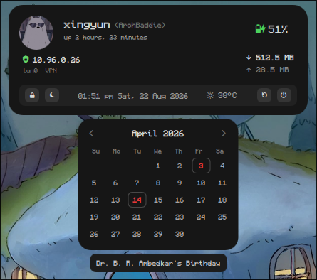
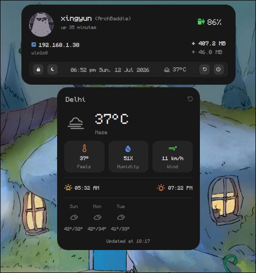
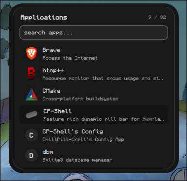
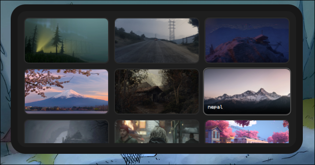
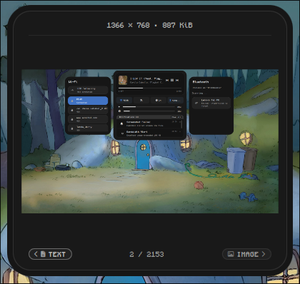
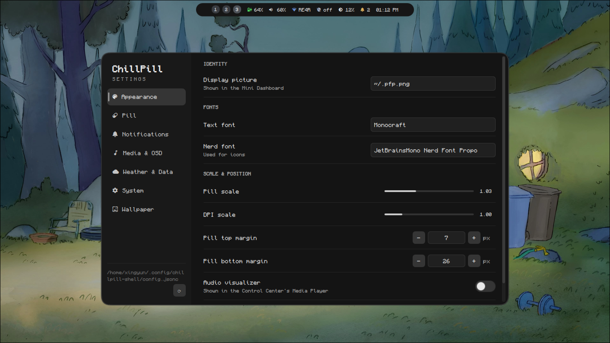

# ChillPill-Shell

<div align="center">

[](https://github.com/LUCKYS1NGHH/ChillPill-Shell)
[](https://github.com/LUCKYS1NGHH/ChillPill-Shell/stargazers)
[](https://github.com/quickshell-mirror/quickshell)
[](https://www.gnu.org/licenses/gpl-3.0)

ChillPill-Shell is a **lightweight**, feature-rich dynamic pill bar for Hyprland, built with **Quickshell**.
It's aimed squarely at users running without a dedicated GPU (like me) — eye candy that doesn't cost you a discrete card. Runs great on integrated graphics.

It runs as a **standalone app**: launch it from your terminal or app launcher when you want it, rather than having it baked
into your session at all times. It's not bound to any dotfiles.

</div>

<div align="center">

[](#resource-usage)
[](#showcase)
[](#features-pill-states)
[](#configuration-app)
[](#custom-pill-modules)
[](#dependencies)
[](#install)
[](#auto-startup)
[](#key-bindings)
[](#contributors)

</div>

---

### Resource Usage

- RAM: 200-500 MB (Average 400)
- CPU: Idle 0%, Average 3%, Min 0.1%, Max 10%
- GPU: Idle 0%, Average 15%, Min 6%, Max 40%

> CPU and GPU usage varies with system. a better CPU and GPU use less.

#### My Hardware

- RAM: 8GB (DDR3)
- CPU: i5 3337U (Dual-core)
- GPU: Intel HD 4000 (Integrated)

---

### Showcase

[Watch the demo on YouTube](https://www.youtube.com/watch?v=t7ydMT4F478)

<table>
  <tr>
    <td width="50%">
      <p align="center"><b>Main pill bar</b></p>
      
    </td>
    <td width="50%">
      <p align="center"><b>Control center</b></p>
      
    </td>
  </tr>
  <tr>
    <td width="50%">
      <p align="center"><b>Media playing popup</b></p>
      
    </td>
    <td width="50%">
      <p align="center"><b>Notification popup (nusgmon-alert)</b></p>
      
    </td>
  </tr>
  <tr>
    <td width="50%">
      <p align="center"><b>Cliphist (clipboard manager)</b></p>
      
    </td>
    <td width="50%">
      <p align="center"><b>Mini dashboard — calendar</b></p>
      
    </td>
  </tr>
  <tr>
    <td width="50%">
      <p align="center"><b>Mini dashboard — weather</b></p>
      
    </td>
    <td width="50%">
      <p align="center"><b>Volume OSD (has more OSDs like brightness, battery, timer)</b></p>
      
    </td>
  </tr>
  <tr>
    <td width="50%">
      <p align="center"><b>App launcher</b></p>
      
    </td>
    <td width="50%">
      <p align="center"><b>Control center — Wifi and Bluetooth panel</b></p>
      
    </td>
  </tr>
  <tr>
    <td width="50%">
      <p align="center"><b>Wallpaper switcher</b></p>
      
    </td>
    <td width="50%">
      <p align="center"><b>Cliphist — Full preview tab (Image; Text also supports)</b></p>
      
    </td>
  </tr>
</table>

## Features (Pill States)

- **Main Pill Bar**                - Battery, volume, workspaces, network, clock (default; customizable) — for more module options, see 'Know more' below.
- **Control Center**               - Media player, buttons (WiFi, Silent Notifs, Timer, Bluetooth), volume & brightness sliders, notification stack
- **Cliphist (Clipboard Manager)** - Search (optional fuzzy search), clipboard image preview, item index status, multi select to delete many items at once (<kbd>Shift</kbd> + <kbd>Up</kbd>/<kbd>Down</kbd> range, <kbd>Shift</kbd> + <kbd>Space</kbd> pick, <kbd>Del</kbd> to delete), <kbd>Tab</kbd> to full preview the clipboard image/text
- **Mini Dashboard**               - Profile image, username, hostname, uptime, battery, basic network info, today's data usage, datetime, weather, calendar, power buttons (lock, sleep, shutdown, reboot)
  - **Calendar Popup**             - Previous/Next month buttons, event dates
  - **Weather Popup**              - Feel, humidity, wind, sunrise & sunset, upcoming 2 days weather forecast, manual refresh button
- **App Launcher**                 - List of applications (<kbd>Tab</kbd> to read the long app description), optional fuzzy search
- **DBus Notification**            - App icon (optional), summary, body (YES! you can ditch swaync/dunst fully now)
- **OSD**                          - Battery, volume, brightness, timer
- **Wallpaper switcher**           - A wallpaper switcher. <kbd>.</kbd> or <kbd>CTRL</kbd> + <kbd>H</kbd> to see hidden images (dot prefixed)
- **Power Menu**                   - 5 actions (Lock, Sleep, Logout, Restart, Shutdown) and action confirmation prompt

<details>
<summary>Know more</summary>

---
- Main pill bar modules has tooltips

- Extra modules available for the pill bar beyond the defaults: `weather`, `bluetooth`, `vpn`, `notifications`, `brightness`, `audioVisualizer`

- Pill bar supports custom modules (waybar-style) — run any command/script in the bar with `format`/`tooltip` templates, refresh intervals, streaming output and click actions (see [Custom pill modules](#custom-pill-modules)).

- 3 pill states are open-able with mouse:

  - Control center: <kbd>Left click</kbd>
  - Cliphist: <kbd>Middle click</kbd>
  - Mini Dashboard: <kbd>Right click</kbd>

  For the rest of states, you have to call the IPC through keybinds in Hyprland, which are provided in [Keybinds](#key-bindings)
  section (including the mouse open-able states)

- DPI and Pill scaling is available in the config if you need it.

- Audio, workspaces, bluetooth and wifi in pill bar are clickable.

- Control center's media player progress bar is not only for status, it's usable to control the media you playing.
  also timer minutes can be change by right click and hold-to-burst (stop) it when running.

- The live audio spectrum (needs `cava`) is drawn in two independent flavours: bottom-anchored in the control center's
  media player (toggled by `showAudioVisuals`), and mirrored around its middle line (a wave instead of a skyline) -x
  as the `audioVisualizer` pill bar module (toggled by adding/removing it from `pillModules`). Either one can be used
  without the other.

- Control center has WiFi controller (panel) which has list of active networks and has password prompt.

- The wifi panel also includes the USB tethering toggle.

- Control center has also Bluetooth controller which has list of active, pair & connected devices/networks, device battery. here's 3 cases to connect a bluetooth device first time:

  - case 1: device wants a PIN or passkey typed in
  - case 2: device just wants us to display a code
  - case 3: device wants a yes/no confirmation of a shown passkey

- Cliphist shows image previews from `~/.cache/chillpill-shell/cliphist-imgs` by converting image binaries into real images and save there. if
  you want these images cache to auto delete when you delete the cliphist (clipboard manager) image item, then there's `deleteCliphistImgCache` config
  option (enabled by default).

- In Cliphist full preview tab (which opens through <kbd>Tab</kbd> key), you can switch to other item by <kbd>Up</kbd>/<kbd>Down</kbd> keys, and can also delete the item from there.

- Cliphist items can be multi selected through keys, then deleted in one go with <kbd>Del</kbd>:

  - <kbd>Shift</kbd> + <kbd>Up</kbd> / <kbd>Shift</kbd> + <kbd>Down</kbd>: mark a range of items, editor style (grows and shrinks from where the range started)
  - <kbd>Shift</kbd> + <kbd>Space</kbd>: mark/unmark the item under the cursor (works in the full preview too, the marked count shows as a chip there)
  - <kbd>Ctrl</kbd> + <kbd>Click</kbd> / <kbd>Shift</kbd> + <kbd>Click</kbd>: same toggle with the mouse
  - <kbd>Del</kbd>: deletes the marked items, or the highlighted one when nothing is marked
  - <kbd>Esc</kbd>: drops the marks first, closes the panel on the second press

- Notifications, brightness and volume are able to show in slide animation (similar to iOS mute) while you playing video game or watching movie
  in full screen.

- Your today's data usage in mini dashboard is shown by [nusgmon](https://github.com/LUCKYS1NGHH/nusgmon) (i am the creator of it too).

- Wallpaper switcher shows you the filename of the image on hover. uses `awww` in backend to update the wallpaper by default (optional dep).
---
</details>

## Configuration App
> Raw config is still located at `~/.config/chillpill-shell/config.jsonc`



</details>

## Custom Pill Modules

Besides the built-in Quickshell modules (`battery`, `workspaces`, `network`, `clock`, `vpn`, `notifications` etc.), `pillModules` also accepts
**object entries** that run any command/script and show its output in the bar — kind of similar to
[waybar's custom module](https://github.com/Alexays/Waybar/wiki/Module:-Custom).

| Key | Description |
|---|---|
| `run` | Command to execute **(required)**. Just pass the script name if it's in `~/.config/chillpill-shell/modules`, else with leading `~` or absolute path |
| `icon` | Optional nerdfont icon, referenced in `format`/`tooltip` as `{icon}` |
| `format` | Text shown in the bar. Supports `{text}` / `{tooltip}` / `{icon}` placeholders. Default: `{icon} {text}` (or just `{text}` without an icon) |
| `tooltip` | Tooltip shown on hover. Supports `{text}` / `{tooltip}` / `{icon}` placeholders. Default: the output's tooltip |
| `every` | Refresh every N seconds. Omit (or `0`) to run once at startup |
| `stream` | Keep the process running and update the module on every stdout line (`true`) |
| `click` | Command run on left click |

The command may print **plain text** (used as `{text}`) or a **JSON object** per run / per line:

```json
{ "icon": "", "color": "#6d9fd7", "text": "45°C", "tooltip": "45°C CPU Temperature" }
```

A sample script ship in the repo and get installed to
`~/.config/chillpill-shell/modules/`: `cpu-temp.sh` (one-shot CPU temperature,
prints a temperature-dependent `{icon, color, text, tooltip}` JSON line).
Scripts in that directory can be referenced by their plain file name, so
`"run": "cpu-temp.sh"` works, scripts living anywhere else need a `~` path or an absolute one.
Use your custom scripts to see specific/niche info in ChillPill-Shell's Pill Bar.

## Dependencies
> [!NOTE]
> Currently it's tested only on: **Arch Linux** and **NixOS** + **Hyprland**.
> Packages below are Arch's; find the equivalent for your distro.

- [cliphist](https://github.com/sentriz/cliphist)
- [nusgmon](https://github.com/LUCKYS1NGHH/nusgmon) (AUR package; non-Arch users can use the setup script instead)
- [inotify-tools](https://github.com/inotify-tools/inotify-tools)
- [brightnessctl](https://github.com/Hummer12007/brightnessctl)
- [wl-clipboard](https://github.com/bugaevc/wl-clipboard)
- [pipewire](https://github.com/PipeWire/pipewire)
- [blueman](https://github.com/blueman-project/blueman)
- Qt Multimedia (`qt6-multimedia` on Arch)

> [!TIP]
> `install.sh` auto-installs all of the above for Arch users, **except** these optional packages:

- Monocraft Font (`ttf-monocraft-git` / `ttf-monocraft-nerd` on AUR)
- JetBrainsMono Nerd Font (`ttf-jetbrains-mono-nerd` on Arch)
- `qt6-imageformats` (on Arch) more image format support (e.g. WEBP) for wallpaper previews
- `holidays` (Python lib) event dates in calendar; `install.sh` prompts to install this one
- `cava` for showing audio visuals
- `awww` for wallpaper switcher if you don't use custom wallpaper script

## Install

> [!TIP]
> Use my Hyprland [dotfiles](https://github.com/LUCKYS1NGHH/dotfiles), it's also made for No Dedicated GPU machines.
> You will get more better performance.

#### Arch users (AUR)

```bash
paru -S chillpill-shell
```

#### NixOS users (flake with Home Manager)

Add this repository as an input to your flake:

```nix
{
  inputs = {
    chillpill-shell = {
      url = "github:LUCKYS1NGHH/chillpill-shell";
      inputs.nixpkgs.follows = "nixpkgs";
    };
  };
}
```

Enable and configure it in your Home Manager configuration:

```nix
{ chillpill-shell, ... }:
{
  imports = [
    chillpill-shell.homeManagerModules.default
  ];

  programs.chillpill-shell = {
    enable = true;
    settings = {
      clockFormat = "HH:mm";
      # Other options from config.jsonc
    };
  };
}
```

#### Other
```bash
git clone --depth=1 https://github.com/LUCKYS1NGHH/ChillPill-Shell.git
cd ChillPill-Shell
chmod +x install.sh
sudo ./install.sh # use --skip-deps to skip dependencies installation (arch currently)
```

<details>
<summary>Uninstall?</summary>

---

#### AUR
```bash
paru -R chillpill-shell
```

#### Other
```bash
chmod +x uninstall.sh
sudo ./uninstall.sh
```

---
</details>

### Auto startup

To auto-run at every time you start your Hyprland, paste this code in your `~/.config/hypr/hyprland.lua` config file

```lua
hl.on("hyprland.start", function()
   hl.exec_cmd("chillpill-shell")
end)
```

## Key Bindings

Keybindings are highly recommended for ChillPill-Shell in your Hyprland, Just paste this code in your Hyprland (Lua) config file.

> Adjust key combinations by your preferences

```lua
hl.bind(mainMod .. " + CTRL + C",  hl.dsp.exec_cmd("qs ipc -p /usr/share/chillpill-shell call controlCenter toggle"))
hl.bind(mainMod .. " + CTRL + V",  hl.dsp.exec_cmd("qs ipc -p /usr/share/chillpill-shell call cliphist toggle"))
hl.bind(mainMod .. " + CTRL + B",  hl.dsp.exec_cmd("qs ipc -p /usr/share/chillpill-shell call miniDashboard toggle"))
hl.bind(mainMod .. " + D", hl.dsp.exec_cmd("qs ipc -p /usr/share/chillpill-shell call appLauncher toggle"))
hl.bind(mainMod .. " + W", hl.dsp.exec_cmd("qs ipc -p /usr/share/chillpill-shell call wallpaperSwitcher toggle"))
hl.bind(mainMod .. " + Escape", hl.dsp.exec_cmd("qs ipc -p /usr/share/chillpill-shell call powerMenu toggle"))
```

<details>
<summary>NixOS version</summary>

```lua
hl.bind(mainMod .. " + CTRL + C",  hl.dsp.exec_cmd("chillpill-shell-ipc call controlCenter toggle"))
hl.bind(mainMod .. " + CTRL + V",  hl.dsp.exec_cmd("chillpill-shell-ipc call cliphist toggle"))
hl.bind(mainMod .. " + CTRL + B",  hl.dsp.exec_cmd("chillpill-shell-ipc call miniDashboard toggle"))
hl.bind(mainMod .. " + D", hl.dsp.exec_cmd("chillpill-shell-ipc call appLauncher toggle"))
hl.bind(mainMod .. " + W", hl.dsp.exec_cmd("chillpill-shell-ipc call wallpaperSwitcher toggle"))
hl.bind(mainMod .. " + Escape", hl.dsp.exec_cmd("chillpill-shell-ipc call powerMenu toggle"))
```
</details>

---

### Contributors

Thanks to the contributors who helped make the shell better, and special thanks to [enhaoswen](https://github.com/enhaoswen) for the Wi-Fi controller backend for Quickshell.

<a href="https://github.com/LUCKYS1NGHH/chillpill-shell/graphs/contributors">
  
</a>

### Author

LUCKYS1NGHH / https://github.com/LUCKYS1NGHH/ChillPill-Shell
